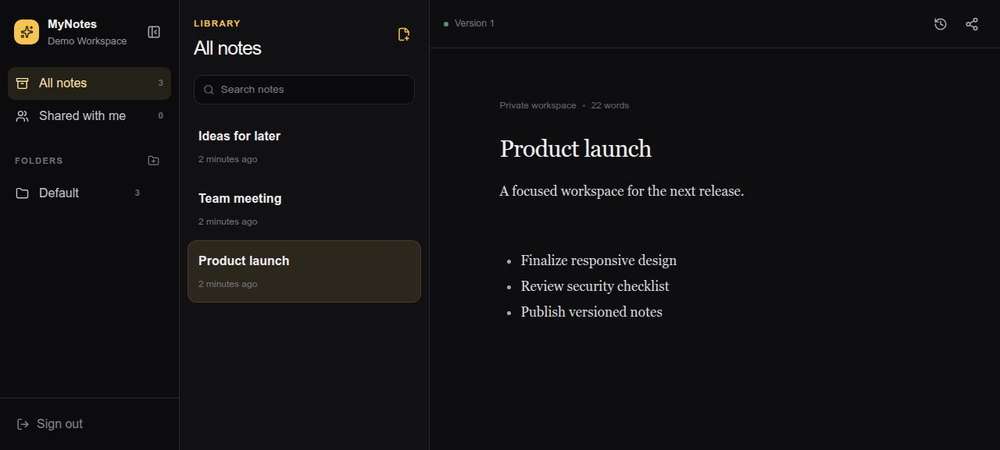

# MyNotes

A private, multi-user workspace for notes and files, built with Bun, React, TypeScript, Tailwind CSS, Tiptap, and SQLite. Notes are stored as portable Markdown files with immutable version history; uploaded files sit next to them in the same folders.

Documentation: [pankajsoni19.github.io/mynotes](https://pankajsoni19.github.io/mynotes/)

<p align="center">
  
</p>

## Features

MyNotes is a private, self-hosted home for the notes you cannot afford to lose: everyday ideas, runbooks, credentials, and configuration. It combines a calm, dark writing space with ownership, version history, and access controls that stay on your machine.

- **One home for your workspace.** After sign-in, Home offers three apps: **Notes**, **Files**, and the shared **Bin**. Every app, folder, note, and file has its own URL, so links can be bookmarked and browser Back/Forward work on desktop and phone.
- **Write without friction.** A responsive, macOS Notes-inspired workspace pairs folders and note cards with an Outline-like editor, slash commands, Markdown formatting, checklists, links, quotes, code blocks, inline images, and tables. Any note can be downloaded as a PDF.
- **Keep files next to your notes.** Files shares the folder tree with Notes: upload with progress, preview images, PDFs, text, audio, and video safely, download, rename, move, share, and delete with Undo.
- **Find anything fast.** Full-text search covers note titles and bodies, ignores case and accents, matches words as you type, and highlights where they appear. Results respect sharing exactly: you only ever see notes you can open, and your drafts only you can find.
- **Keep every meaningful change.** Edits begin as drafts, save automatically, publish as immutable versions, and can be compared or restored when you need to understand how a note evolved.
- **Share deliberately.** Notes start private. Share an individual note or a folder with trusted accounts or everyone signed in, with note-level permissions taking precedence.
- **Recover mistakes.** Deleted notes and files wait in a shared Bin for 30 days, with their history and sharing intact, before they are removed for good.
- **Connect trusted AI clients.** An authenticated Streamable HTTP MCP server lets tools search and read your published notes through revocable, one-time-visible API keys. Drafts and write operations stay out of reach.
- **Own portable data.** Content remains readable Markdown on disk; SQLite holds the metadata, identities, sessions, folders, sharing rules, and version index.
- **Protect sensitive knowledge.** Argon2id passwords, cookie and CSRF protections, optional or required Google Authenticator-compatible two-factor authentication, encrypted TOTP data, and a hardened non-root Docker container provide a practical local security baseline.
- **Run and recover simply.** One Docker Compose service runs on port `2026`, migrates its database on boot, and includes verified weekly gzip backups with five-week retention.

## Using MyNotes

### Home and URLs

Signing in lands on **Home**, which links to Notes, Files, and the Bin; the MyNotes wordmark and each app's Home control lead back. Each view has a real URL, and reloading or opening a link resumes that view (a signed-out visit shows the login screen first, then continues to the requested page):

| URL | View |
| --- | --- |
| `/` | Home |
| `/notes` | Notes, all folders (resumes your last note when no folder or note is named) |
| `/notes/folder/<folder-id>` | Notes in one folder |
| `/notes/shared` | Notes shared with you |
| `/notes/<note-id>` | One note in the editor |
| `/files` | Files, all folders |
| `/files/folder/<folder-id>` | Files in one folder |
| `/files/shared` | Files shared with you |
| `/files/<file-id>` | One file's preview and details |
| `/bin` | Bin |

Unknown paths open Home. A link to a note or file you cannot read (or that is missing or in the Bin) falls back to the list with a message. On phones, Back steps from the editor or preview to the list, then to the folders, then to Home, without leaving the site; with a dialog or sheet open, Back only closes it.

### Notes editor

Type `/` for the command menu. Besides headings, lists, checklists, quotes, and code blocks:

- **`/image`**, or paste or drop an image into the editor, uploads it to the note's folder in Files and embeds it. Only PNG, JPEG, GIF, and WebP are accepted, and the server's own type check must agree. Removing an image from a note leaves the file in Files.
- **`/table`** inserts a 3×3 table with a header row. A floating toolbar adds or removes rows and columns and deletes the table; tables are saved as GitHub-flavoured Markdown pipe tables and scroll sideways on phones.
- **Download as PDF** (editor toolbar, or the actions menu on phones) opens the browser's print dialog with a print layout of the note; choose "Save as PDF".

**Limitation:** an embedded image follows the sharing of the **folder** it was uploaded to, not the note's own sharing. If you share a note more widely than its folder, those readers see the text but a broken image. Nothing leaks; share the folder (or the image file) too if they need the images.

### Search

The search box at the top of the note list searches the text of your notes, not just their titles. Press `Ctrl+K` (`⌘K` on a Mac) or `/` to jump to it, and `Esc` to clear it.

- **What matches.** Every word you type must appear in the note, in any order; case and accents are ignored, so `creme` finds "Crème". The last word matches as a prefix while you type (`brul` finds "brûlée"); end the query with a space to match whole words only. Put words in `"double quotes"` to match them as an exact phrase. Punctuation and operators such as `AND`, `OR`, `NOT`, `*`, or `title:` are treated as ordinary text, not search syntax. Link text, image descriptions, and code are searched; link addresses are not.
- **What you see.** Your own notes are searched as you last saved them, including unpublished drafts, which are marked **Draft**. Notes shared with you are searched as their latest published version; you never see someone else's draft. Notes in the Bin are not searched until restored. Matches in the title rank first, and each result shows a highlighted excerpt, its folder, its owner when it is not yours, and when it was last edited.
- **Scope.** Search covers the section you are in: All notes, Shared with me, or one folder. Choose **Search all notes** to widen it. Opening a result from outside the current section switches to All notes.
- **Keyboard and phone.** Use ↑ and ↓ to move through results and Enter to open one. On phones, Back from a note returns to the results with your query kept; Back again closes the search. The query is kept in the browser tab's history state, never in the URL.
- Searching is limited to 20 searches per 10 seconds per user; the list falls back to title matches and says so if you go faster. Queries are limited to 200 characters. Files are not searched yet.

### Files

Files lists documents in the same folders as your notes. Each app shows only its own item type.

- **Upload** with the Upload button, by dropping files from your computer onto the list, or on phones from the upload sheet. Uploads run two at a time with a progress bar, and can be cancelled or retried. Each file may be up to `MAX_UPLOAD_BYTES` (100 MiB by default) and counts towards `USER_STORAGE_QUOTA_BYTES`; see [Configuration](#configuration).
- **Any file type is stored**, but only safe types are shown in the app. The server decides the type from the file's first bytes, not from its name or the browser's claim:

  | Type | Preview |
  | --- | --- |
  | PNG, JPEG, GIF, WebP | shown inline |
  | PDF | opens in a new browser tab |
  | UTF-8 text (`.txt`, `.md`, `.csv`, `.tsv`, `.log`, `.json`) | first 1 MiB shown as plain text, with a notice when truncated |
  | MP3, Ogg, WAV, M4A, MP4, WebM | audio or video player |
  | everything else (including SVG, HTML, Office files, archives) | download only |

- **Download**, **Rename**, **Move**, **Share**, and **Delete** are in each row's ⋯ menu (an action sheet on phones). On desktop, ↑/↓ move the selection, Enter opens the preview, F2 renames, and Delete or Backspace deletes. Drag a file onto a folder to move it; the toast states the new effective sharing. Sort by name, date, or size, and filter by name.
- **Sharing** works like notes: a file inherits its folder's sharing unless you give it its own (private, selected people, or everyone signed in). People you share with can preview and download but not change anything.
- **Delete** moves the file to the Bin; the toast offers **Undo** for a few seconds.

MyNotes does **not** strip EXIF or other embedded metadata (for example GPS location or author) from uploaded images or PDFs. Remove it before uploading if you plan to share the file.

## Quick start

1. Copy `.env.example` to `.env` if you need to override the defaults.
2. Ensure `/srv/mynotes` exists and is writable by Docker, or set `MYNOTES_DATA_DIR` to another host directory.
3. Run `APP_VERSION=0.4.1 GIT_SHA=$(git rev-parse --short HEAD) docker compose up --build`.
4. Open `http://localhost:2026`.

The first account can always be created from the login screen while the database is empty. Later registrations are disabled by default. Temporarily set `ALLOW_REGISTRATION=true` only while adding trusted local users, then turn it off again. Set `ALLOWED_EMAILS` to a comma-separated allowlist; when present, only those addresses may register, sign in, or keep an existing session. “Everyone here” sharing includes all current and future registered users on that allowlist.

### Two-factor authentication

Generate a server-side encryption key and keep it only in `.env`:

```sh
openssl rand -base64 32
```

Set the output as `TOTP_ENCRYPTION_KEY`. Set `TOTP_POLICY=optional` to let each user choose, or `TOTP_POLICY=required` to force enrollment before notes can be accessed. Click the clearly labelled Settings control in the left navigation, open **Security**, scan the locally generated QR code with Google Authenticator, and verify one six-digit code. The grouped setup key is entered only while adding MyNotes to an authenticator; copying it removes visual spaces. Sign-in uses the current six-digit authenticator number or one complete, one-time recovery code. TOTP secrets and the recoverable backup-code list are encrypted in SQLite with AES-256-GCM; changing or losing the encryption key makes existing authenticator enrollments unusable.

If a user loses their authenticator, the local machine administrator can reset that factor. This revokes every session and forces fresh enrollment on the next password sign-in:

```sh
docker compose exec app bun server/reset-totp.ts user@example.com
```

### MCP server

Open **Settings → MCP server** to create, review, or revoke API keys and copy a ready-to-paste Streamable HTTP client configuration. Each key is displayed in full only once; MyNotes stores its SHA-256 hash and a short identifying prefix, never the plaintext credential.

The MCP endpoint is `http://localhost:2026/mcp` for the default deployment. It currently provides `list_notes` and `read_note`, restricted to the latest published versions the key owner can already access through MyNotes sharing rules. Drafts and write operations are intentionally excluded. Treat API keys like passwords, use a separate key per client, and revoke keys you no longer need.

### LAN and Tailscale access

`APP_ORIGINS` is a comma-separated allowlist of exact browser origins. Keep localhost and add every trusted LAN or Tailscale HTTPS origin you use, including its port when non-standard:

```dotenv
APP_ORIGINS=http://localhost:2026,http://192.168.10.20:2026,https://your-device.your-tailnet.ts.net
```

Docker is published on port `2026` for LAN access. Prefer Tailscale Serve with HTTPS and keep `COOKIE_SECURE=true`. Direct plain-HTTP access such as `http://192.168.10.20:2026` requires `COOKIE_SECURE=false`; this is less safe for notes containing credentials, even on a trusted home network. Never use a wildcard origin.

## Configuration

Compose passes these variables from `.env` (see `.env.example`). Invalid values stop the server at startup with a message naming the variable.

| Variable | Default | Purpose and validation |
| --- | --- | --- |
| `MYNOTES_DATA_DIR` | `/srv/mynotes` | Host directory Compose mounts at `/data`. Must be writable by UID 1000. Used by Compose and `scripts/backup.sh`, not by the server. |
| `PORT` | `2026` | Port the server listens on inside the container. |
| `DATA_DIR` | `/data` | Data root inside the container. Leave unchanged under Compose. |
| `APP_ORIGIN` | `http://localhost:2026` | Primary browser origin; the fallback for `APP_ORIGINS`. |
| `APP_ORIGINS` | `APP_ORIGIN` | Comma-separated exact `http(s)` origins accepted for sign-in, mutations, and MCP host checks. Entries with a path, credentials, query, or fragment are rejected. |
| `COOKIE_SECURE` | `true` (Compose and production) | `true` or `false`. Plain-HTTP access needs `false`. |
| `ALLOW_REGISTRATION` | `false` | `true` allows additional accounts; the first account is always allowed on an empty database. |
| `ALLOWED_EMAILS` | empty | Comma-separated allowlist for registration, sign-in, and existing sessions. Empty allows any address. |
| `TOTP_POLICY` | `optional` | `optional` or `required`. |
| `TOTP_ENCRYPTION_KEY` | empty | Base64-encoded 32-byte key. Required when `TOTP_POLICY=required`. |
| `SESSION_DAYS` | `14` | Session lifetime in days, at least 1. |
| `MAX_MARKDOWN_BYTES` | `2000000` | Largest note body, at least 1024 bytes. |
| `MAX_UPLOAD_BYTES` | `104857600` (100 MiB) | Largest single file. Integer from `1048576` (1 MiB) to `2147483648` (2 GiB). Bun's request body cap is this (or 2.1 MB, whichever is larger) plus 1 MiB; JSON bodies stay limited to 2.1 MB. |
| `USER_STORAGE_QUOTA_BYTES` | `10737418240` (10 GiB) | Document bytes per user, including documents in the Bin. Integer ≥ 0; `0` means unlimited. |
| `MIN_FREE_DISK_BYTES` | `1073741824` (1 GiB) | Uploads are refused when they would leave less free space than this on the data volume. Integer ≥ 0. |
| `APP_VERSION` | `0.4.0` | Build metadata shown in Settings → About. |
| `GIT_SHA` | `development` | Commit shown in Settings → About (first 40 characters). |

Fixed limits that are not configurable: 3 uploads in progress per user on the server (the app sends 2 at a time), 30-day Bin retention, 1 MiB text previews, and an hourly sweeper.

## Development

Development runs on the host with Bun (Compose only defines the production `app` service):

```sh
bun install
DATA_DIR=./data APP_ORIGIN=http://localhost:5173 COOKIE_SECURE=false ALLOW_REGISTRATION=true bun run dev
bun run dev:client
```

`bun run dev` serves the API on port `2026` (stop the Docker container first, since it uses the same port) and restarts on changes. `bun run dev:client` starts Vite at `http://localhost:5173` and proxies `/api` to it. `./data` is ignored by Git. Run `bun run typecheck` and `bun test` before committing.

## Storage

The container reads and writes `/data`, mapped by Compose to:

```text
/srv/mynotes
├── mynotes.sqlite (+ -wal, -shm)
├── notes/<note-id>/
│   ├── current.md
│   ├── draft.md
│   └── versions/000001.md
├── documents/
│   ├── objects/<document-id>      uploaded file bytes
│   └── .staging/<document-id>.part uploads in progress (not backed up)
└── backup/                        weekly archives (host backup script only)
```

Markdown files and documents are never exposed as static files; authenticated API handlers enforce access before reading them. Notes and files in the Bin stay in place on disk until they are deleted forever.

### Documents and upload limits

Uploaded documents are stored only under server-generated ids, next to the notes:

```text
/srv/mynotes/documents/
├── objects/<document-id>          file bytes, no extension
└── .staging/<document-id>.part    uploads in progress
```

File names live only in SQLite and are never used as paths. Uploads are streamed to `.staging` on the data volume (never to the container's small `/tmp`), and a sweeper removes abandoned staging files and orphaned objects at boot and hourly. The limits are `MAX_UPLOAD_BYTES`, `USER_STORAGE_QUOTA_BYTES`, and `MIN_FREE_DISK_BYTES` (see [Configuration](#configuration)); a refused upload reports which one applied.

Only one MyNotes instance may use a data directory at a time: upload slots, per-document locks, and the sweeper live in the process. Do not run a second container or a development server against the same directory.

## Bin

Deleting a note or a file moves it to the shared **Bin** (Home → Bin, or `/bin`) for exactly **30 days**. The retention period is fixed and not configurable. The Bin lists only your own deleted items, newest first, with the days left for each; filter by notes or files.

- **What is kept:** everything. A binned note keeps its draft, published versions, and files on disk; a binned file keeps its bytes. Sharing rows are kept too, so restoring an item gives its previous audience access again. While an item is in the Bin nobody can read it, including its owner outside the Bin and MCP clients.
- **Restore** puts an item back in its original folder, or in your Default folder if the original was deleted. The confirmation toast names the folder and says when the item is shared again (a Default folder shared with others widens its audience).
- **Blank notes** that were never published skip the Bin and are removed at once, so the Bin does not fill with empty drafts. Any note with content, published or not, goes to the Bin, including an unpublished note whose draft you discard.
- **Delete forever** and **Empty Bin** remove items permanently. After 30 days an hourly sweeper (which also runs at boot) deletes expired items for you, in batches of 100 per run. A purge first marks the item so it can never be read or restored again, then removes its files, then its database row; if the process stops half way, the next sweep finishes the job.
- Documents in the Bin still count towards `USER_STORAGE_QUOTA_BYTES` until they are deleted forever.

**Upgrading from 0.3.0 or earlier:** notes deleted before this version (which the old interface described as permanent) reappear in the Bin for 30 days after the upgrade, then are deleted automatically. Never-published notes deleted before the upgrade are removed on the first sweep. Empty the Bin, or delete those items forever, if you do not want to keep them for that window.

## Database migrations

Every image carries immutable numbered migrations under `server/migrations`. They run transactionally and are recorded in SQLite's `schema_migrations` table before the HTTP server accepts requests. Existing databases are upgraded automatically on container boot; new schema changes must be added as a new migration rather than editing an already released migration.

**Upgrading to 0.5.0:** migration 008 adds the search index tables, and the first boot fills them from the notes on disk before the server accepts requests, logging only counts (`Search index: N indexed, …`). Later boots only repair rows that are missing or stale. The index stores a plain-text copy of each note's published version and draft inside `mynotes.sqlite`, so it lives on the same disk and in the same backups as the notes themselves.

The data directory is forced to mode `0700`; SQLite, WAL/SHM, and Markdown files use `0600`. The service refuses symlinked note directories/files.

## Weekly backups

Run the host-side backup script once a week:

```sh
./scripts/backup.sh
```

It briefly stops a running app container so the SQLite database and Markdown files are captured at the same point in time, writes a verified gzip archive under `/srv/mynotes/backup` (or your configured data directory), keeps the newest five archives, and starts the app again. A second run within seven days is skipped; use `./scripts/backup.sh --force` only when you intentionally want an extra snapshot.

For unattended weekly execution, add this entry with `crontab -e` (Sunday at 03:00):

```cron
0 3 * * 0 cd /path/to/mynotes && ./scripts/backup.sh >> /srv/mynotes/backup/backup.log 2>&1
```

To restore, stop MyNotes, extract an archive into an empty data directory, point `MYNOTES_DATA_DIR` at that directory if it differs from the default, and run `docker compose up -d --build`:

```sh
mkdir -p /srv/mynotes-restored
tar -xzf /srv/mynotes/backup/mynotes-YYYYMMDDTHHMMSSZ.tar.gz \
  -C /srv/mynotes-restored
MYNOTES_DATA_DIR=/srv/mynotes-restored docker compose up -d --build
```

The archive contains the data directory contents at its root, so no path rearrangement is required. Keep the same `.env` (in particular `TOTP_ENCRYPTION_KEY`) when starting the restored copy, and start only one MyNotes instance per data directory.

Archives include `documents/objects` but not `documents/.staging`. With documents stored, archive size and the time the app is stopped grow with the stored files (gzip gains little on already-compressed media), and five archives multiply that disk use. Items in the Bin are included in backups like live ones, and a note or file you delete forever (or that expires from the Bin) can survive in older archives for up to about five weeks, until those archives rotate out.

The backup intentionally does not include `.env`. Store `.env` securely alongside your backup process—especially `TOTP_ENCRYPTION_KEY`, which is required to use restored TOTP enrollments.
